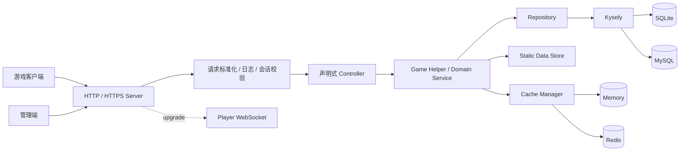

<h1 align="center">XYSky 2.0</h1>

<p align="center">
  <strong>面向《Sky: Children of the Light》的模块化 Node.js 游戏服务端实现（暂不开源）</strong>
  <br>
  <sub>覆盖账号、社交、经济、任务、内容、实时通信，并为持续扩展保留清晰边界。</sub>
</p>

<p align="center">
  
  
  
  
  
</p>

<p align="center">
  <a href="#项目亮点">项目亮点</a> ·
  <a href="#能力矩阵">能力矩阵</a> ·
  <a href="#架构设计">架构设计</a> ·
  <a href="#快速开始">快速开始</a> ·
  <a href="#配置说明">配置说明</a>
</p>

---

## 项目定位

XYSky 不只是若干接口的集合，而是一套围绕游戏服务端生命周期组织的后端工程。目前源码包含 **200+ 个声明式控制器路由**，同时提供玩家 WebSocket、管理 WebSocket、静态数据驱动、数据库迁移、缓存抽象、事件调度和内容审核等基础设施。

项目默认使用 SQLite 与内存缓存，适合本地开发和快速部署；需要承载更长期的数据与多实例场景时，可切换到 MySQL 与 Redis。

> 本项目为社区技术研究与服务端实现项目，与 thatgamecompany 无隶属或官方合作关系。使用者应自行确认客户端资源、网络服务与部署行为符合适用条款和当地法律。

## 项目亮点

| 设计 | 带来的价值 |
| --- | --- |
| **开箱即用的默认组合** | SQLite + Memory Cache 无需额外中间件即可启动，降低首次运行成本。 |
| **可平滑扩展的基础设施** | 数据库支持 SQLite / MySQL，缓存支持 Memory / Redis，业务代码无需绑定单一部署形态。 |
| **一文件一路由** | 控制器通过 `static route` 声明接口，由加载器递归发现并注册，新增功能不必维护庞大的路由表。 |
| **清晰的业务分层** | Controller、Helper、Repository、Kysely 数据层各司其职，复杂游戏逻辑更容易定位和维护。 |
| **配置与内容数据分离** | 服务参数使用 YAML，商店、任务、活动、Buff、收集品等使用 JSON/Lua 静态数据，运营调整不必侵入核心代码。 |
| **实时能力完整** | 在多ws下，ws管理器使用独立 WebSocket 通道，共享 HTTP/HTTPS Server，并带连接管理、心跳与消息队列。 |
| **面向开发的热更新** | 源码运行时可重新加载控制器、玩家 WebSocket、缩短调试反馈周期。 |
| **可运营性设计** | 提供用户、库存、好友、消息、违规、每日任务、配置与缓存等管理 API。 |
| **安全与治理能力** | 玩家会话校验、统一错误处理、内容审核、违规访问状态映射均已纳入服务链路。 |

## 能力矩阵

| 领域 | 已实现能力 |
| --- | --- |
| 账号与会话 | 账号创建、登录、会话验证 |
| 经济与库存 | 锻造汇率、物品兑换、魔法品、光翼 |
| 商店与商业 | 通用商店、先祖商店 |
| 好友与关系 | 邀请、好友、关注、好友能力、在线好友通知 |
| 社交内容 | 聊天、消息、点赞、评论 |
| 任务与活动 | 每日任务、世界任务、奖励领取、季节结算、动态事件调度 |
| 场景与联机 | Stage 状态、小屋状态、好友房间加入
| 安全 | 违规记录、登录或聊天限制、内容审核 |
| UGC 与录制 | 录制创建、查询、更新 |

## 技术栈

| 层级 | 技术 |
| --- | --- |
| Runtime | Node.js 18+、CommonJS、Module Alias |
| HTTP | Express 5、CORS、HTTP / HTTPS |
| Realtime | `ws` WebSocket |
| Database | Kysely、better-sqlite3、mysql2 |
| Cache | 内存缓存、ioredis |
| Auth | jsonwebtoken、会话存储与校验 |
| Configuration | YAML + JSON/Lua 静态数据 |

## 架构设计



### 请求链路

1. Express 接收 HTTP/HTTPS 请求并标准化 JSON、表单或兼容格式的请求体。
2. 中间件记录请求、验证玩家会话，并将可信身份写入 `req.auth`。
3. 自动加载器找到对应的 `BaseController` 子类，完成中间件、必填参数和异常转发。
4. 控制器调用领域 Helper，Helper 组合 Repository、静态数据与缓存完成业务。
5. Repository 通过 Kysely 访问 SQLite 或 MySQL，启动时自动执行版本化迁移。


## 快速开始

### 环境要求

- Windows/Linux
- 可选：MySQL 8+、Redis 6+

### 克隆/安装

1. 克隆仓库  
git clone https://github.com/Thexiaoyuqaq/that-sky-xysky-public.git

2. 下载二进制程序  
根据系统版本从 [Releases](https://github.com/Thexiaoyuqaq/that-sky-xysky-public/releases) 页面下载对应压缩包。  
（Windows 需额外下载并安装证书 `xysky-local-code-signing.cer` 至“受信任的根证书颁发机构”）

3. 解压到仓库目录  
将压缩包内容解压至 `that-sky-xysky-public` 文件夹中，完成部署。

### 最小配置

项目已提供 `config/config.yml` 和 `config/cache.yml`。首次启动前至少应生成并替换 JWT 密钥：

```bash
node -e "console.log(require('crypto').randomBytes(32).toString('hex'))"
```

将输出写入：

```yaml
# config/config.yml
jwt:
  secret: "替换为至少 32 字符的随机密钥"
  expiresIn: "7d"
```

默认配置使用：

- HTTP：`0.0.0.0:25565`
- Database：`SQLite`，文件位于 `data/db/sky.db`
- Cache：进程内 Memory Cache
- Player WebSocket：`ws://localhost:25565/account/ws`

### 启动服务

# Linux：赋予执行权限并启动
chmod +x xysky-linux-x64
./xysky-linux-x64

# Windows：直接双击 xysky.exe 或在命令行中执行
xysky.exe

启动后可访问：

```text
GET http://localhost:25565/
```

正常响应：

```json
{ "message": "Hello Xiaoyu." }
```

## 配置说明

配置由 `config/config.yml` 与 `config/cache.yml` 合并加载。

### 服务配置

| 配置项 | 默认值 | 说明 |
| --- | --- | --- |
| `server.host` | `0.0.0.0` | 监听地址 |
| `server.type` | `http` | 支持 `http`、`https`、`http,https` |
| `server.http.port` | `25565` | HTTP 端口 |
| `server.https.port` | `25566` | HTTPS 端口 |
| `server.https.cert` | `./data/ssl/fullchain.pem` | HTTPS 证书 |
| `server.https.key` | `./data/ssl/privkey.key` | HTTPS 私钥 |

### 数据库配置

SQLite 适合单机与开发环境：

```yaml
database:
  type: "sqlite"
  sqlite:
    path: "./data/db/sky.db"
  migrations:
    runOnStartup: true
```

MySQL 适合持久运行和独立数据库部署：

```yaml
database:
  type: "mysql"
  mysql:
    host: "127.0.0.1"
    port: 3306
    user: "xysky"
    password: "change-me"
    name: "xysky"
    connectionLimit: 10
```

### 缓存配置

本地内存缓存：

```yaml
# config/cache.yml
cache:
  type: "memory"
  namespace: "xysky"
```

Redis 缓存：

```yaml
cache:
  type: "redis"
  namespace: "xysky"
  redis:
    host: "127.0.0.1"
    port: 6379
    db: 0
    password: ""
```

部署前请完成以下检查：

- 更换 `jwt.secret`。
- 公网部署启用 HTTPS，或在可信反向代理后终止 TLS。
- MySQL 与 Redis 不对公网开放，并使用独立账号和密码。
- 根据需求启用 `contentModeration.enabled`，维护 `data/server/blocked_words.json`。


### 修改静态内容

常用内容位于 `data/server/`：

- `shop.json`、`generic_shops.json`、`spirit_shops/`
- `quest_defs.json`、`events.config.json`、`events.list.json`
- `buff_defs.json`、`consumable_defs.json`、`currency_types.json`
- `trust_*_defs.json`、`blocked_words.json`、`motd.json`

## 当前状态

项目处于持续开发阶段。核心服务链路和大量业务接口已经实现。

---

## 许可证

[MIT License](LICENSE) © GNU General Public License v3.0

----

<p align="center">
  <sub>Made with ❤️ for XYSKY 2.0 community</sub>
</p>

