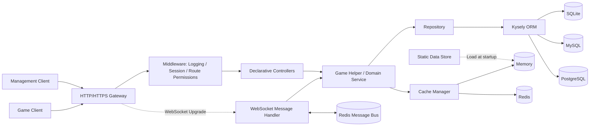

<h1 align="center">XYSky 2.0</h1>

<p align="center">
  <strong>A modular Node.js game server implementation for <em>Sky: Children of the Light</em> (currently not open source)</strong>
  <br>
  <sub>Covers accounts, social systems, economy, quests, content, real-time communication, and more, with clear boundaries for future expansion.</sub>
</p>

<p align="center">
  <a href="README_zh.md">🇨🇳 中文</a> ·
  <strong>🇬🇧 English</strong>
</p>

<p align="center">
  
  
  
  
  
</p>

<p align="center">
  <a href="#project-overview">Project Overview</a> ·
  <a href="#highlights">Highlights</a> ·
  <a href="#capability-matrix">Capabilities</a> ·
  <a href="#technology-stack">Technology Stack</a> ·
  <a href="#architecture">Architecture</a> ·
  <a href="#quick-start">Quick Start</a> ·
  <a href="#configuration">Configuration</a> ·
  <a href="#companion-udp-servers">UDP Servers</a> ·
  <a href="#community">Community</a>
</p>

---

## Project Overview

XYSky is more than a collection of API endpoints. It is a backend engineering project organized around the lifecycle of a game server.

The current source tree contains **200+ declarative controller routes**, together with player WebSocket services, management WebSocket services, static data management, database migrations, cache abstractions, event scheduling, content moderation, and other supporting infrastructure.

The default deployment uses SQLite and an in-memory cache, making it suitable for local development and quick deployment. For longer-running deployments and multi-instance environments, the system can be switched to MySQL or PostgreSQL with Redis-based caching.

> This project is an independent community technology research and server implementation project. It is not affiliated with or officially endorsed by thatgamecompany. Users are responsible for ensuring that client resources, network services, and deployment practices comply with applicable terms and local laws.

## Highlights

| Design | Value |
| --- | --- |
| **Ready-to-use defaults** | SQLite + Memory Cache require no additional middleware, reducing the initial setup cost. |
| **Flexible database backends** | Supports SQLite, MySQL, and PostgreSQL, allowing deployments to choose between local simplicity and dedicated database infrastructure. |
| **Scalable caching infrastructure** | Supports both in-process Memory Cache and Redis without coupling business logic to a specific cache implementation. |
| **One file, one route** | Controllers declare endpoints through `static route`. The loader discovers and registers them recursively, eliminating the need to maintain a large centralized routing table. |
| **Clear business layering** | Controller, Helper, Repository, and Kysely data layers each have distinct responsibilities, making complex game logic easier to locate and maintain. |
| **Configuration separated from content** | Server configuration uses YAML, while shops, quests, events, buffs, collectibles, and other static content use JSON/Lua data. Operational adjustments can therefore be made without modifying core logic. |
| **Complete real-time support** | Multiple WebSocket channels are supported. The WebSocket manager uses independent management channels, shares the HTTP/HTTPS server, and provides connection management, heartbeats, and message queues. |
| **Developer-oriented hot reload** | Controllers and player WebSocket handlers can be reloaded at runtime, shortening the development and debugging feedback loop. |
| **Operational capabilities** | Provides management APIs for users, inventories, friends, messages, violations, daily quests, configuration, and caches. |
| **Security and governance** | Player session validation, unified error handling, content moderation, and violation-related access status mapping are integrated into the service pipeline. |

## Capability Matrix

| Domain | Implemented Capabilities |
| --- | --- |
| Account & Session | Account creation, login, and session validation |
| Economy & Inventory | Forge exchange rates, item exchanges, spells, and Winged Light |
| Shops & Commerce | Generic shops and Spirit shops |
| Friends & Relationships | Invitations, friends, following, friend capabilities, and online friend notifications |
| Social Content | Chat, messages, likes, and comments |
| Quests & Events | Daily quests, world quests, reward claiming, seasonal settlement, and dynamic event scheduling |
| Scenes & Multiplayer | Stage state, Home state, and joining friends' rooms |
| Security | Violation records, login/chat restrictions, and content moderation |
| UGC & Recording | Recording creation, querying, and updating |

## Technology Stack

| Layer | Technology |
| --- | --- |
| Runtime | Node.js 26, CommonJS, Module Alias |
| HTTP | Express 5, CORS, HTTP / HTTPS |
| Realtime | `ws` WebSocket |
| Database | Kysely, better-sqlite3, mysql2, PostgreSQL |
| Cache | In-memory cache, ioredis |
| Auth | jsonwebtoken, session storage and validation |
| Configuration | YAML + JSON/Lua static data |

## Architecture


```mermaid
flowchart LR
    %% Client and entry points
    C[Game Client] --> H[HTTP/HTTPS Gateway]
    A[Management Client] --> H

    %% Gateway layer
    H --> M[Middleware: Logging / Session / Route Permissions]
    M --> R[Declarative Controllers]

    %% WebSocket
    H -. WebSocket Upgrade .-> W[WebSocket Message Handler]
    W --> B[Game Helper / Domain Service]
    W <--> RedisBus[(Redis Message Bus)]

    %% Business logic
    R --> B

    %% Persistence
    B --> P[Repository]
    P --> K[Kysely ORM]
    K --> D1[(SQLite)]
    K --> D2[(MySQL)]
    K --> D3[(PostgreSQL)]

    %% Cache
    B --> CA[Cache Manager]
    CA --> C1[(Memory)]
    CA --> C2[(Redis)]

    %% Static data
    S[Static Data Store] -. Load at startup .-> C1
```

### Request Flow

1. Express receives HTTP/HTTPS requests and normalizes JSON, form, or compatible request bodies.
2. Middleware records the request, validates the player session, and stores the trusted identity in `req.auth`.
3. The automatic loader discovers the corresponding `BaseController` subclass and handles middleware, required parameters, and exception forwarding.
4. The controller invokes the domain Helper, which combines Repository operations, static data, and caches to complete the business logic.
5. The Repository accesses SQLite, MySQL, or PostgreSQL through Kysely. Versioned database migrations are automatically executed at startup.

## Quick Start

The distribution is provided as a precompiled standalone executable with the runtime bundled, so **Node.js does not need to be installed separately when using the released binary**.

### Requirements

- Operating system: Windows 10+ or Linux (x64)
- Development runtime: Node.js 26
- Optional: MySQL 8+, PostgreSQL 14+, Redis 6+
- The default SQLite + Memory Cache configuration requires no external database or cache service.

### Download & Deployment

1. Clone the repository to obtain the configuration and static data directories:

   ```bash
   git clone https://github.com/Thexiaoyuqaq/that-sky-xysky-public.git
   ```

2. Download the binary for your platform from the [Releases](https://github.com/Thexiaoyuqaq/that-sky-xysky-public/releases) page.

   > Windows users must additionally download the `xysky-local-code-signing.cer` certificate and install it under "Trusted Root Certification Authorities".

3. Extract the archive into the `that-sky-xysky-public` directory, alongside `config/` and `data/`.

### Minimal Configuration

The project provides `config/config.yml` and `config/cache.yml`.

Before starting the server for the first time, **replace the default JWT secret**. The example value is for demonstration purposes only and must not be used in production.

Generate a random secret:

```bash
node -e "console.log(require('crypto').randomBytes(32).toString('hex'))"
```

> If Node.js is not installed locally, you may use any other method to generate a random hexadecimal string of at least 32 characters.

Set the generated value in `config/config.yml`:

```yaml
# config/config.yml
jwt:
  secret: "replace-with-a-random-secret-of-at-least-32-characters"
  expiresIn: "7d"
```

The default configuration uses:

- HTTP: `0.0.0.0:25565`
- Database: `SQLite`, stored at `data/db/sky.db`
- Cache: Process-local Memory Cache
- Player WebSocket: `ws://localhost:25565/account/ws`
- UDP endpoint: configured through `udp.uri`

### Start the Server

```bash
# Linux: grant execute permission and start
chmod +x xysky-linux-x64
./xysky-linux-x64
```

```bat
:: Windows: double-click xysky.exe or run it from a command prompt
xysky.exe
```

After startup, access:

```text
GET http://localhost:25565/
```

Expected response:

```json
{ "message": "Hello Xiaoyu." }
```

## Configuration

Configuration is loaded by merging `config/config.yml` and `config/cache.yml`.

### Server Configuration

| Configuration | Default | Description |
| --- | --- | --- |
| `server.host` | `0.0.0.0` | Listening address |
| `server.type` | `http` | Supports `http`, `https`, and `http,https` |
| `server.http.port` | `25565` | HTTP port |
| `server.https.port` | `25566` | HTTPS port |
| `server.https.cert` | `./data/ssl/fullchain.pem` | HTTPS certificate |
| `server.https.key` | `./data/ssl/privkey.key` | HTTPS private key |

### Database Configuration

#### SQLite

SQLite is suitable for single-machine and development environments:

```yaml
database:
  type: "sqlite"
  sqlite:
    path: "./data/db/sky.db"
  migrations:
    runOnStartup: true
```

#### MySQL

MySQL is suitable for persistent deployments and standalone database infrastructure:

```yaml
database:
  type: "mysql"
  mysql:
    host: "127.0.0.1"
    port: 3306
    user: "xysky"
    password: "change-me"
    name: "xysky"
    connectionLimit: 10
    queueLimit: 0
    idleTimeout: 60000
    maxIdle: 5
    connectTimeout: 10000
    ssl: false
  migrations:
    runOnStartup: true
```

#### PostgreSQL

PostgreSQL can be used as an alternative dedicated relational database backend:

```yaml
database:
  type: "postgres"
  postgres:
    host: "127.0.0.1"
    port: 5432
    user: "postgres"
    password: "change-me"
    name: "xysky"
    max: 10
    idleTimeout: 30000
    connectTimeout: 10000
    ssl: false
  migrations:
    runOnStartup: true
```

### Cache Configuration

#### Local Memory Cache

```yaml
# config/cache.yml
cache:
  type: "memory"
  namespace: "xysky"
```

#### Redis

```yaml
cache:
  type: "redis"
  namespace: "xysky"
  redis:
    host: "127.0.0.1"
    port: 6379
    db: 0
    password: ""
```

### Logger Configuration

```yaml
logger:
  api_register: false
  request_stack_error: true
```

| Configuration | Description |
| --- | --- |
| `logger.api_register` | Controls API registration logging |
| `logger.request_stack_error` | Controls request stack error logging |

### Game Configuration

The server also provides game-level configuration for initial currency and social-feed behavior.

```yaml
game:
  initialCurrency:
    candles: 5
    hearts: 5
    season_candle: 5
    prestige: 5

  socialFeed:
    socialFeedExpireDays: 30
    uri: "serveruri.cn"
```

The `socialFeed.curatedFeeds` section can be used to control feed priority, query limits, radius parameters, bucket behavior, scoring version, and lightweight response fields.

### UDP Configuration

The HTTP/HTTPS backend can be configured with an external UDP endpoint:

```yaml
udp:
  uri: "127.0.0.1:19132"
```

The UDP endpoint is intended to be used together with a compatible Sky UDP server implementation.

See the [Companion UDP Servers](#companion-udp-servers) section below.

### CDN Configuration

```yaml
cdn:
  host: "sky.resources.cdn.thatgamecompany.com"
  prefix: ""
```

### MQTT Configuration

MQTT integration can be configured when required:

```yaml
mqtt:
  brokerUrl: ""
  username: ""
  password: ""
```

### Content Moderation

```yaml
contentModeration:
  enabled: false
  blockMode: "direct"
  replacementChar: "*"
  logViolations: true
```

Before deployment, complete the following checks:

- Replace `jwt.secret`.
- Enable HTTPS for public deployments, or terminate TLS behind a trusted reverse proxy.
- Do not expose MySQL, PostgreSQL, or Redis directly to the public internet.
- Use dedicated database accounts and strong passwords.
- Enable `contentModeration.enabled` as required.
- Maintain `data/server/blocked_words.json` when content moderation is enabled.

## Modifying Static Content

Common content files are located under `data/server/`:

- `shop.json`, `generic_shops.json`, `spirit_shops/`
- `quest_defs.json`, `events.config.json`, `events.list.json`
- `buff_defs.json`, `consumable_defs.json`, `currency_types.json`
- `trust_*_defs.json`, `blocked_words.json`, `motd.json`

---

## Companion UDP Servers

The XYSky HTTP / WebSocket server can be used together with a separate UDP server to handle real-time game communication, room management, player transfers, and other real-time networking logic.

There are currently two independent UDP implementations available.

### XYSKY UDP

**Repository:**  
https://github.com/that-sky-project/that-sky-xysky-udp-team

**XYSKY UDP** is currently the primary UDP server implementation in the XYSky ecosystem. It is designed for the **Sky: Children of the Light 34.5 client protocol**, written in Node.js, and uses ENet to provide reliable UDP game communication.

The current public implementation includes relatively complete real-time multiplayer functionality, including:

- Complete player transfer (`MoveGame`) logic
- Room management and room state handling
- Room migration and switching
- Strict validation of fields used by the current protocol
- Fixes for snapshot-related issues
- Complete connection-state handling for player joining, movement, disconnection, and related events

The project is also designed to work with a separate **Room Authority / Room Manager (QWD)**:

https://github.com/that-sky-project/that-sky-xysky-udp-room-authority

QWD is responsible for allocating and managing game rooms and provides:

```http
GET /allocate
```

which is used to obtain or allocate an available game room.

The overall architecture can be roughly represented as:

```text
XYSky
  │
  │ Request a room
  ▼
QWD / Room Authority
  │
  │ /allocate
  ▼
XYSKY UDP Room
  │
  ├─ Player connections
  ├─ PlayerState
  ├─ Snapshot
  ├─ Player transfer / MoveGame
  └─ Real-time room synchronization
```

The current XYSKY UDP implementation performs relatively strict field validation against the target client protocol. Therefore, it **should not be considered a cross-version generic UDP server**.

Different versions of the Sky client may use different `PlayerState` and related data structures. Even if server-side validation is relaxed, the client itself may not be able to correctly process data from another protocol version.

When the client and server versions do not match, issues such as being unable to freely select locations after entering the constellation screen, abnormal room states, or other synchronization problems may occur.

Therefore, when using XYSKY UDP, make sure that:

> **The client version, XYSKY UDP protocol implementation, and data structures used by the XYSky backend are compatible with each other.**

### ColorSky UDP

**Repository:**  
https://github.com/that-sky-project/that-sky-colorsky-udp

**ColorSky UDP** is another independent UDP Server / Relay implementation. It is written in Rust and uses ENet for UDP communication, with CRC32 packet checksums for data validation.

Compared with XYSKY UDP, ColorSky UDP is designed more around **UDP relay / forwarding**. It does not fully parse a large number of Sky protocol fields and instead focuses more on forwarding network data.

It can therefore be used as an alternative UDP deployment option for XYSky, but its compatibility with the current client protocol should be taken into account.

Depending on the client and server versions, ColorSky UDP may have differences such as:

- A relatively outdated protocol implementation
- Some fields not being fully parsed
- Compatibility differences with newer client versions
- Different protocol coverage compared with XYSKY UDP
- Differences in player transfer or room behavior compared with the current XYSKY UDP implementation

Therefore:

> **When strict compatibility with the current Sky client protocol and complete room logic is required, XYSKY UDP should generally be preferred. For a lightweight Rust-based UDP Relay / Forwarding implementation, ColorSky UDP may be considered instead.**

The current public ColorSky UDP repository provides Rust build instructions. It listens on `0.0.0.0:5413` by default and supports configuring the listening address and port through the CLI or `config.toml`.

### UDP Endpoint Configuration

XYSky uses `udp.uri` to specify the UDP server endpoint:

```yaml
udp:
  uri: "127.0.0.1:19132"
```

When using XYSKY UDP, this address should normally point to the actual UDP Room endpoint exposed to the client.

For example:

```yaml
udp:
  uri: "127.0.0.1:19132"
```

> **Note:** `udp.uri` should contain the UDP address that the client can actually reach, either through a public or internal network address. It should not simply be the server's local bind/listening address if that address is not reachable by the client.

### Choosing a UDP Implementation

| Implementation | Language | Role | Protocol Handling | Room / Transfer Support | Typical Use |
|---|---|---|---|---|---|
| **XYSKY UDP** | Node.js | Full Sky UDP Room Server | Full parsing and validation for the target client version | Full support | Primary UDP solution for XYSky |
| **ColorSky UDP** | Rust | UDP Relay / Forwarding | Primarily focused on data forwarding | Different capabilities and implementation scope | Lightweight relay, experimental, or alternative deployments |

> XYSKY UDP and ColorSky UDP are **not two versions of the same project**. They are two independent UDP server implementations with different design goals and protocol coverage.
>
> Before deployment, choose the implementation according to the client version, protocol compatibility requirements, and the room functionality required by your deployment.

## Current Status

The project is under active development.

The core service pipeline and a large number of business APIs have already been implemented. Database, cache, HTTP, WebSocket, static-data, and UDP integration are designed as separate components so that individual parts can continue to evolve independently.

---

## Community

### That Sky Project

We would like to thank **That Sky Project**:

https://github.com/that-sky-project

That Sky Project is an independent community of players around *Sky: Children of the Light*. According to its public GitHub profile, the organization focuses on building an independent open-source mod development ecosystem and promotes technical exchange, knowledge sharing, and community-driven development.

Its public repositories cover areas such as Sky-related engine research, mod development infrastructure, tooling, protocol/network-related projects, and other technical experiments.

The organization is community-driven rather than an official project of *Sky: Children of the Light*, and XYSky is likewise an independent project.

> Please read the organization's own [Legal Notice](https://github.com/that-sky-project) and the documentation of each individual repository before using related resources.

---

## Disclaimer

XYSky and the related projects mentioned in this README are independent community projects.

They are not official products of thatgamecompany or *Sky: Children of the Light*.

Users are responsible for determining whether their use of client software, game resources, network protocols, reverse-engineering tools, server implementations, or related materials is permitted under applicable software licenses, game terms of service, and local law.

---

## License

[GNU General Public License v3.0](LICENSE)

---

<p align="center">
  <sub>Made with ❤️ for the XYSky 2.0 community</sub>
</p>