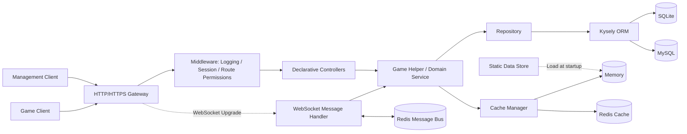

<h1 align="center">XYSky 2.0</h1>

<p align="center">
  <strong>A modular Node.js game server implementation for <em>Sky: Children of the Light</em> (currently not open source)</strong>
  <br>
  <sub>Covers accounts, social systems, economy, quests, content, real-time communication, and more, with clear boundaries for future expansion.</sub>
</p>

<p align="center">
  <a href="README_zh.md">🇨🇳 中文</a> ·
  <strong>🇬🇧 English</strong>
</p>

<p align="center">
  
  
  
  
  
</p>

<p align="center">
  <a href="#project-overview">Project Overview</a> ·
  <a href="#highlights">Highlights</a> ·
  <a href="#capability-matrix">Capabilities</a> ·
  <a href="#technology-stack">Technology Stack</a> ·
  <a href="#architecture">Architecture</a> ·
  <a href="#quick-start">Quick Start</a> ·
  <a href="#configuration">Configuration</a>
</p>

---

## Project Overview

XYSky is more than a collection of API endpoints. It is a backend engineering project organized around the lifecycle of a game server.

The current source tree contains **200+ declarative controller routes**, together with player WebSocket services, management WebSocket services, static data management, database migrations, cache abstractions, event scheduling, content moderation, and other supporting infrastructure.

The default deployment uses SQLite and an in-memory cache, making it suitable for local development and quick deployment. For longer-running deployments and multi-instance environments, the system can be switched to MySQL and Redis.

> This project is an independent community technology research and server implementation project. It is not affiliated with or officially endorsed by thatgamecompany. Users are responsible for ensuring that client resources, network services, and deployment practices comply with applicable terms and local laws.

## Highlights

| Design | Value |
| --- | --- |
| **Ready-to-use defaults** | SQLite + Memory Cache require no additional middleware, reducing the initial setup cost. |
| **Smooth infrastructure scaling** | Database support includes SQLite / MySQL, while caching supports Memory / Redis, allowing business logic to remain independent of a specific deployment model. |
| **One file, one route** | Controllers declare endpoints through `static route`. The loader discovers and registers them recursively, eliminating the need to maintain a large centralized routing table. |
| **Clear business layering** | Controller, Helper, Repository, and Kysely data layers each have distinct responsibilities, making complex game logic easier to locate and maintain. |
| **Configuration separated from content** | Server configuration uses YAML, while shops, quests, events, buffs, collectibles, and other static content use JSON/Lua data. Operational adjustments can therefore be made without modifying core logic. |
| **Complete real-time support** | Multiple WebSocket channels are supported. The WebSocket manager uses independent management channels, shares the HTTP/HTTPS server, and provides connection management, heartbeats, and message queues. |
| **Developer-oriented hot reload** | Controllers and player WebSocket handlers can be reloaded at runtime, shortening the development and debugging feedback loop. |
| **Operational capabilities** | Provides management APIs for users, inventories, friends, messages, violations, daily quests, configuration, and caches. |
| **Security and governance** | Player session validation, unified error handling, content moderation, and violation-related access status mapping are integrated into the service pipeline. |

## Capability Matrix

| Domain | Implemented Capabilities |
| --- | --- |
| Account & Session | Account creation, login, and session validation |
| Economy & Inventory | Forge exchange rates, item exchanges, spells, and Winged Light |
| Shops & Commerce | Generic shops and Spirit shops |
| Friends & Relationships | Invitations, friends, following, friend capabilities, and online friend notifications |
| Social Content | Chat, messages, likes, and comments |
| Quests & Events | Daily quests, world quests, reward claiming, seasonal settlement, and dynamic event scheduling |
| Scenes & Multiplayer | Stage state, Home state, and joining friends' rooms |
| Security | Violation records, login/chat restrictions, and content moderation |
| UGC & Recording | Recording creation, querying, and updating |

## Technology Stack

| Layer | Technology |
| --- | --- |
| Runtime | Node.js 22, CommonJS, Module Alias |
| HTTP | Express 5, CORS, HTTP / HTTPS |
| Realtime | `ws` WebSocket |
| Database | Kysely, better-sqlite3, mysql2 |
| Cache | In-memory cache, ioredis |
| Auth | jsonwebtoken, session storage and validation |
| Configuration | YAML + JSON/Lua static data |

## Architecture


```mermaid
flowchart LR
    %% Client and entry points
    C[Game Client] --> H[HTTP/HTTPS Gateway]
    A[Management Client] --> H

    %% Gateway layer: route isolation
    H --> M[Middleware: Logging / Session / Route Permissions]
    M --> R[Declarative Controllers]

    %% WebSocket upgrade and cluster synchronization
    H -. WebSocket Upgrade .-> W[WebSocket Message Handler]
    W --> B[Game Helper / Domain Service]
    W <--> RedisBus[(Redis Message Bus)]

    %% Business logic
    R --> B

    %% Persistence layer
    B --> P[Repository]
    P --> K[Kysely ORM]
    K --> D1[(SQLite)] 
    K --> D2[(MySQL)]

    %% Multi-level cache
    B --> CA[Cache Manager]
    CA --> C1[(Memory)]
    CA --> RedisCache[(Redis Cache)]

    %% Static configuration
    S[Static Data Store] -. Load at startup .-> C1
```

### Request Flow

1. Express receives HTTP/HTTPS requests and normalizes JSON, form, or compatible request bodies.
2. Middleware records the request, validates the player session, and stores the trusted identity in `req.auth`.
3. The automatic loader discovers the corresponding `BaseController` subclass and handles middleware, required parameters, and exception forwarding.
4. The controller invokes the domain Helper, which combines Repository operations, static data, and caches to complete the business logic.
5. The Repository accesses SQLite or MySQL through Kysely. Versioned database migrations are automatically executed at startup.

## Quick Start

The distribution is provided as a precompiled standalone executable with the runtime bundled, so **Node.js does not need to be installed separately**.

### Requirements

- Operating system: Windows 10+ or Linux (x64)
- Optional: MySQL 8+, Redis 6+ (the default SQLite and in-memory cache require neither)

### Download & Deployment

1. Clone the repository to obtain the configuration and static data directories:

   ```bash
   git clone https://github.com/Thexiaoyuqaq/that-sky-xysky-public.git
   ```

2. Download the binary for your platform from the [Releases](https://github.com/Thexiaoyuqaq/that-sky-xysky-public/releases) page.

   > Windows users must additionally download the `xysky-local-code-signing.cer` certificate and install it under "Trusted Root Certification Authorities".

3. Extract the archive into the `that-sky-xysky-public` directory, alongside `config/` and `data/`.

### Minimal Configuration

The project provides `config/config.yml` and `config/cache.yml`.

Before starting the server for the first time, **replace the default JWT secret**. The default value is for demonstration purposes only and must not be used in production.

Generate a random secret:

```bash
node -e "console.log(require('crypto').randomBytes(32).toString('hex'))"
```

> If Node.js is not installed locally, you may use any other method to generate a random hexadecimal string of at least 32 characters.

Set the generated value in `config/config.yml`:

```yaml
# config/config.yml
jwt:
  secret: "replace-with-a-random-secret-of-at-least-32-characters"
  expiresIn: "7d"
```

The default configuration uses:

- HTTP: `0.0.0.0:25565`
- Database: `SQLite`, stored at `data/db/sky.db`
- Cache: Process-local Memory Cache
- Player WebSocket: `ws://localhost:25565/account/ws`

### Start the Server

```bash
# Linux: grant execute permission and start
chmod +x xysky-linux-x64
./xysky-linux-x64
```

```bat
:: Windows: double-click xysky.exe or run it from a command prompt
xysky.exe
```

After startup, access:

```text
GET http://localhost:25565/
```

Expected response:

```json
{ "message": "Hello Xiaoyu." }
```

## Configuration

Configuration is loaded by merging `config/config.yml` and `config/cache.yml`.

### Server Configuration

| Configuration | Default | Description |
| --- | --- | --- |
| `server.host` | `0.0.0.0` | Listening address |
| `server.type` | `http` | Supports `http`, `https`, and `http,https` |
| `server.http.port` | `25565` | HTTP port |
| `server.https.port` | `25566` | HTTPS port |
| `server.https.cert` | `./data/ssl/fullchain.pem` | HTTPS certificate |
| `server.https.key` | `./data/ssl/privkey.key` | HTTPS private key |

### Database Configuration

SQLite is suitable for single-machine and development environments:

```yaml
database:
  type: "sqlite"
  sqlite:
    path: "./data/db/sky.db"
  migrations:
    runOnStartup: true
```

MySQL is suitable for persistent deployments and standalone database infrastructure:

```yaml
database:
  type: "mysql"
  mysql:
    host: "127.0.0.1"
    port: 3306
    user: "xysky"
    password: "change-me"
    name: "xysky"
    connectionLimit: 10
```

### Cache Configuration

Local in-memory cache:

```yaml
# config/cache.yml
cache:
  type: "memory"
  namespace: "xysky"
```

Redis cache:

```yaml
cache:
  type: "redis"
  namespace: "xysky"
  redis:
    host: "127.0.0.1"
    port: 6379
    db: 0
    password: ""
```

Before deployment, complete the following checks:

- Replace `jwt.secret`.
- Enable HTTPS for public deployments, or terminate TLS behind a trusted reverse proxy.
- Do not expose MySQL or Redis directly to the public internet. Use dedicated accounts and passwords.
- Enable `contentModeration.enabled` as required and maintain `data/server/blocked_words.json`.

### Modifying Static Content

Common content files are located under `data/server/`:

- `shop.json`, `generic_shops.json`, `spirit_shops/`
- `quest_defs.json`, `events.config.json`, `events.list.json`
- `buff_defs.json`, `consumable_defs.json`, `currency_types.json`
- `trust_*_defs.json`, `blocked_words.json`, `motd.json`

## Current Status

The project is under active development. The core service pipeline and a large number of business APIs have already been implemented.

---

## License

[GNU General Public License v3.0](LICENSE)

---

<p align="center">
  <sub>Made with ❤️ for the XYSKY 2.0 community</sub>
</p>