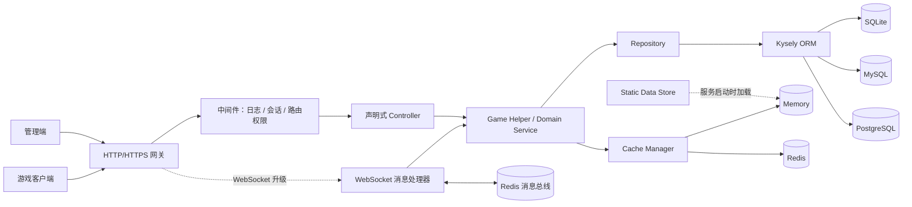

<h1 align="center">XYSky 2.0</h1>

<p align="center">
  <strong>面向《Sky: Children of the Light》的模块化 Node.js 游戏服务端实现（暂不开源）</strong>
  <br>
  <sub>覆盖账号、社交、经济、任务、内容、实时通信，并为持续扩展保留清晰边界。</sub>
</p>

<p align="center">
  <strong>🇨🇳 中文</strong> ·
  <a href="README.md">🇬🇧 English</a>
</p>

<p align="center">
  
  
  
  
  
</p>

<p align="center">
  <a href="#项目定位">项目定位</a> ·
  <a href="#项目亮点">项目亮点</a> ·
  <a href="#能力矩阵">能力矩阵</a> ·
  <a href="#技术栈">技术栈</a> ·
  <a href="#架构设计">架构设计</a> ·
  <a href="#快速开始">快速开始</a> ·
  <a href="#配置说明">配置说明</a> ·
  <a href="#配套-udp-服务器">UDP 服务器</a> ·
  <a href="#社区">社区</a>
</p>

---

## 项目定位

XYSky 不只是若干接口的集合，而是一套围绕游戏服务端生命周期组织的后端工程。

目前源码包含 **200+ 个声明式控制器路由**，同时提供玩家 WebSocket、管理 WebSocket、静态数据驱动、数据库迁移、缓存抽象、事件调度、内容审核以及其他配套基础设施。

项目默认使用 SQLite 与内存缓存，适合本地开发和快速部署；需要承载更长期的数据与多实例场景时，可切换到 MySQL 或 PostgreSQL，并使用 Redis 作为缓存后端。

> 本项目为独立的社区技术研究与服务端实现项目，与 thatgamecompany 无隶属或官方合作关系。使用者应自行确认客户端资源、网络服务与部署行为符合适用条款和当地法律。

## 项目亮点

| 设计 | 带来的价值 |
| --- | --- |
| **开箱即用的默认组合** | SQLite + Memory Cache 无需额外中间件即可启动，降低首次运行成本。 |
| **灵活的数据库后端** | 支持 SQLite、MySQL 和 PostgreSQL，可根据开发、单机部署以及长期运行等不同需求选择数据库。 |
| **可扩展的缓存基础设施** | 支持进程内 Memory Cache 和 Redis，业务代码无需绑定单一缓存实现。 |
| **一文件一路由** | 控制器通过 `static route` 声明接口，由加载器递归发现并注册，新增功能不必维护庞大的集中式路由表。 |
| **清晰的业务分层** | Controller、Helper、Repository、Kysely 数据层各司其职，复杂游戏逻辑更容易定位和维护。 |
| **配置与内容数据分离** | 服务参数使用 YAML，商店、任务、活动、Buff、收集品等使用 JSON/Lua 静态数据，运营调整不必侵入核心代码。 |
| **实时能力完整** | 支持多 WebSocket 通道，WebSocket 管理器使用独立管理通道，共享 HTTP/HTTPS Server，并提供连接管理、心跳和消息队列。 |
| **面向开发的热更新** | 源码运行时可重新加载控制器、玩家 WebSocket，缩短调试反馈周期。 |
| **可运营性设计** | 提供用户、库存、好友、消息、违规、每日任务、配置与缓存等管理 API。 |
| **安全与治理能力** | 玩家会话校验、统一错误处理、内容审核、违规访问状态映射均已纳入服务链路。 |

## 能力矩阵

| 领域 | 已实现能力 |
| --- | --- |
| 账号与会话 | 账号创建、登录、会话验证 |
| 经济与库存 | 锻造汇率、物品兑换、魔法品、光翼 |
| 商店与商业 | 通用商店、先祖商店 |
| 好友与关系 | 邀请、好友、关注、好友能力、在线好友通知 |
| 社交内容 | 聊天、消息、点赞、评论 |
| 任务与活动 | 每日任务、世界任务、奖励领取、季节结算、动态事件调度 |
| 场景与联机 | Stage 状态、小屋状态、好友房间加入 |
| 安全 | 违规记录、登录或聊天限制、内容审核 |
| UGC 与录制 | 录制创建、查询、更新 |

## 技术栈

| 层级 | 技术 |
| --- | --- |
| Runtime | Node.js 26、CommonJS、Module Alias |
| HTTP | Express 5、CORS、HTTP / HTTPS |
| Realtime | `ws` WebSocket |
| Database | Kysely、better-sqlite3、mysql2、PostgreSQL |
| Cache | 内存缓存、ioredis |
| Auth | jsonwebtoken、会话存储与校验 |
| Configuration | YAML + JSON/Lua 静态数据 |

## 架构设计



### 请求链路

1. Express 接收 HTTP/HTTPS 请求并标准化 JSON、表单或兼容格式的请求体。
2. 中间件记录请求、验证玩家会话，并将可信身份写入 `req.auth`。
3. 自动加载器找到对应的 `BaseController` 子类，完成中间件、必填参数和异常转发。
4. 控制器调用领域 Helper，Helper 组合 Repository、静态数据与缓存完成业务。
5. Repository 通过 Kysely 访问 SQLite、MySQL 或 PostgreSQL，并在启动时自动执行版本化数据库迁移。

## 快速开始

发行版为预编译的独立可执行文件，已内置运行时，因此**使用发行版程序时无需单独安装 Node.js**。

### 环境要求

- 操作系统：Windows 10+ 或 Linux（x64）
- 开发环境：Node.js 26
- 可选：MySQL 8+、PostgreSQL 14+、Redis 6+
- 默认 SQLite + Memory Cache 配置无需安装额外数据库或缓存服务

### 下载与部署

1. 克隆仓库以获取配置与静态数据目录：

   ```bash
   git clone https://github.com/Thexiaoyuqaq/that-sky-xysky-public.git
   ```

2. 根据系统从 [Releases](https://github.com/Thexiaoyuqaq/that-sky-xysky-public/releases) 页面下载对应的二进制程序。

   > Windows 用户需额外下载证书 `xysky-local-code-signing.cer`，并将其安装到“受信任的根证书颁发机构”。

3. 解压部署：将压缩包内容解压到 `that-sky-xysky-public` 目录中，与 `config/`、`data/` 同级。

### 最小配置

项目已提供 `config/config.yml` 和 `config/cache.yml`。

首次启动前，请务必替换默认 JWT 密钥。示例密钥仅用于演示，切勿用于生产环境。

生成一个随机密钥：

```bash
node -e "console.log(require('crypto').randomBytes(32).toString('hex'))"
```

> 若本机未安装 Node.js，也可使用任意方式生成一段至少 32 字符的随机十六进制字符串。

将其写入 `config/config.yml`：

```yaml
# config/config.yml
jwt:
  secret: "替换为至少 32 字符的随机密钥"
  expiresIn: "7d"
```

默认配置使用：

- HTTP：`0.0.0.0:25565`
- Database：`SQLite`，文件位于 `data/db/sky.db`
- Cache：进程内 Memory Cache
- Player WebSocket：`ws://localhost:25565/account/ws`
- UDP：通过 `udp.uri` 配置

### 启动服务

```bash
# Linux：赋予执行权限并启动
chmod +x xysky-linux-x64
./xysky-linux-x64
```

```bat
:: Windows：双击 xysky.exe，或在命令行中执行
xysky.exe
```

启动后访问：

```text
GET http://localhost:25565/
```

正常响应：

```json
{
  "message": "Hello Xiaoyu."
}
```

## 配置说明

配置由 `config/config.yml` 与 `config/cache.yml` 合并加载。

### 服务配置

| 配置项 | 默认值 | 说明 |
| --- | --- | --- |
| `server.host` | `0.0.0.0` | 监听地址 |
| `server.type` | `http` | 支持 `http`、`https`、`http,https` |
| `server.http.port` | `25565` | HTTP 端口 |
| `server.https.port` | `25566` | HTTPS 端口 |
| `server.https.cert` | `./data/ssl/fullchain.pem` | HTTPS 证书 |
| `server.https.key` | `./data/ssl/privkey.key` | HTTPS 私钥 |

### 日志配置

```yaml
logger:
  api_register: false
  request_stack_error: true
```

| 配置项 | 说明 |
| --- | --- |
| `logger.api_register` | 控制 API 注册日志 |
| `logger.request_stack_error` | 控制请求堆栈错误日志 |

### 数据库配置

#### SQLite

SQLite 适合单机与开发环境：

```yaml
database:
  type: "sqlite"
  sqlite:
    path: "./data/db/sky.db"
  migrations:
    runOnStartup: true
```

#### MySQL

MySQL 适合长期运行以及独立数据库部署：

```yaml
database:
  type: "mysql"
  mysql:
    host: "127.0.0.1"
    port: 3306
    user: "xysky"
    password: "change-me"
    name: "xysky"
    connectionLimit: 10
    queueLimit: 0
    idleTimeout: 60000
    maxIdle: 5
    connectTimeout: 10000
    ssl: false
  migrations:
    runOnStartup: true
```

#### PostgreSQL

PostgreSQL 可作为独立关系型数据库后端：

```yaml
database:
  type: "postgres"
  postgres:
    host: "127.0.0.1"
    port: 5432
    user: "postgres"
    password: "change-me"
    name: "xysky"
    max: 10
    idleTimeout: 30000
    connectTimeout: 10000
    ssl: false
  migrations:
    runOnStartup: true
```

### 缓存配置

#### 本地内存缓存

```yaml
# config/cache.yml
cache:
  type: "memory"
  namespace: "xysky"
```

#### Redis

```yaml
cache:
  type: "redis"
  namespace: "xysky"
  redis:
    host: "127.0.0.1"
    port: 6379
    db: 0
    password: ""
```

### 游戏配置

服务端还提供游戏级配置，用于控制初始货币以及 Social Feed 等行为：

```yaml
game:
  initialCurrency:
    candles: 5
    hearts: 5
    season_candle: 5
    prestige: 5

  socialFeed:
    socialFeedExpireDays: 30
    uri: "serveruri.cn"
```

`game.socialFeed.curatedFeeds` 可进一步控制 Feed 优先级、查询数量限制、半径参数、Bucket 行为、评分算法版本以及轻量字段返回等。

### UDP 配置

XYSky 可以通过独立的 UDP 服务端提供实时游戏网络能力：

```yaml
udp:
  uri: "127.0.0.1:19132"
```

UDP 服务端可以与 XYSky 的 HTTP / WebSocket 后端配合使用。

详见下方的 [配套 UDP 服务器](#配套-udp-服务器)。

### CDN 配置

```yaml
cdn:
  host: "sky.resources.cdn.thatgamecompany.com"
  prefix: ""
```

### MQTT 配置

在需要 MQTT 集成时，可以进行如下配置：

```yaml
mqtt:
  brokerUrl: ""
  username: ""
  password: ""
```

### 内容审核

```yaml
contentModeration:
  enabled: false
  blockMode: "direct"
  replacementChar: "*"
  logViolations: true
```

部署前请完成以下检查：

- 更换 `jwt.secret`。
- 公网部署启用 HTTPS，或在可信反向代理后终止 TLS。
- 不要将 MySQL、PostgreSQL 或 Redis 直接暴露到公网。
- 使用独立数据库账号以及强密码。
- 根据实际需求启用 `contentModeration.enabled`。
- 启用内容审核后维护 `data/server/blocked_words.json`。

### 修改静态内容

常用内容位于 `data/server/`：

- `shop.json`、`generic_shops.json`、`spirit_shops/`
- `quest_defs.json`、`events.config.json`、`events.list.json`
- `buff_defs.json`、`consumable_defs.json`、`currency_types.json`
- `trust_*_defs.json`、`blocked_words.json`、`motd.json`

---

## 配套 UDP 服务器

XYSky 的 HTTP / WebSocket 服务端可以与独立的 UDP 服务端配合使用，用于处理游戏实时通信、房间管理、玩家串线以及其他实时网络逻辑。

目前 XYSKY UDP 支持两种部署方式：

- **使用 QWD（房间权威管理器）托管**：由 QWD 负责分配和管理 UDP 房间。
- **不使用 QWD 独立运行**：单个 XYSKY UDP Node 直接提供一个最多 8 人的房间。

### XYSKY UDP

**项目地址：**  
https://github.com/that-sky-project/that-sky-xysky-udp-team

**XYSKY UDP** 是目前 XYSky 生态中的主要 UDP 服务端实现，面向 **Sky: Children of the Light 34.5 客户端协议**，使用 Node.js 开发，并基于 ENet 提供可靠 UDP 游戏通信。

当前公开实现包含较完整的实时联机逻辑，包括：

- 完整的玩家串线（`MoveGame`）逻辑
- 房间管理与房间状态处理
- 房间之间的迁移与切换
- 针对当前协议字段的严格校验
- 快照（`Snapshot`）相关问题修复
- 玩家加入、移动、断开等完整连接状态处理

### 使用 QWD 的 XYSKY UDP

当部署多个 UDP 房间服务器时，可以将 XYSKY UDP 与独立的 **Room Authority / Room Manager（QWD）** 配合使用：

https://github.com/that-sky-project/that-sky-xysky-udp-room-authority

QWD 负责分配可用房间，并管理已经注册到 QWD 的 XYSKY UDP Node。

在这种部署方式下，会涉及 **两个不同的 QWD 地址**。

#### 1. XYSky → QWD

XYSky 配置文件中的 `udp.uri` 应填写 **QWD 提供的 HTTP(S) `/allocate` 公网地址**。

例如：

```yaml
udp:
  uri: "https://thatroom.thatskyproject.cn/allocate"
```

当 XYSky 需要创建或获取游戏房间时，会向该地址请求可用房间。

#### 2. XYSKY UDP Node → QWD

XYSKY UDP Node 则通过 **WebSocket** 连接 QWD，并在启动后自动向 QWD 注册当前房间节点。

例如 XYSKY UDP Node 的 `config.yml`：

```yaml
qwd:
  url: "wss://thatroom.thatskyproject.cc"

public_uri: "192.168.11.4:19133"
```

其中：

- `qwd.url` 是 **QWD 的 WebSocket 地址**。
- `public_uri` 是 **这个 XYSKY UDP Node 对客户端开放的公网 UDP 地址**。
- `public_uri` 必须填写客户端实际能够访问的 UDP `IP:端口`。
- XYSKY UDP Node 启动后，会自动连接 QWD 并注册自己的 `public_uri`。

例如服务器实际对外提供：

```text
123.123.123.123:19133
```

那么应配置：

```yaml
public_uri: "123.123.123.123:19133"
```

这里的 `public_uri` 不一定是服务器本地绑定的监听地址，而应该是**客户端实际可以访问的 UDP 地址**。

整体架构可以理解为：

```text
XYSky
  │
  │ HTTP(S) /allocate
  ▼
QWD / 房间权威管理器
  │
  │ WebSocket
  │ 房间注册
  ▼
XYSKY UDP Node
  │
  │ public_uri
  ▼
Sky 客户端
```

使用 QWD 时，整体流程如下：

```text
1. XYSKY UDP Node 启动
2. Node 通过 WebSocket 连接 QWD
3. Node 向 QWD 注册自己的公网 UDP 地址
4. Xysky 通过 HTTP(S) /allocate 请求房间
5. QWD 返回可用的 UDP 房间地址
6. 客户端连接被分配到的 XYSKY UDP Node
```

> **注意：** XYSky 中的 `udp.uri` 和 XYSKY UDP Node 中的 `qwd.url` 用途完全不同，协议也不同。
>
> `udp.uri` → QWD 的 HTTP(S) `/allocate` 地址  
> `qwd.url` → QWD 的 WebSocket 地址

### 不使用 QWD 的 XYSKY UDP

如果不需要 QWD，并且只需要一个**最多 8 人的房间**，则可以让 XYSKY UDP Node 独立运行。

此时将 XYSKY UDP Node 的：

```yaml
qwd:
  url: "wss://thatroom.thatskyproject.cc"
```

修改为：

```yaml
qwd:
  url: ""
```

这样 XYSKY UDP Node 就不会再依赖 QWD，也不会向 QWD 注册房间。

此时 XYSKY UDP Node 可以直接作为独立的 8 人房间服务器使用。

例如服务器公网 IP 为：

```text
123.123.123.123
```

并开放 UDP `1123` 端口，那么 Xysky 的配置可以直接填写：

```yaml
udp:
  uri: "123.123.123.123:1123"
```

整体结构变为：

```text
XYSky
  │
  │ 直接连接 UDP
  ▼
XYSKY UDP Node
  │
  └─ 最多 8 人
```

这种模式下：

- 不需要 QWD
- 不需要 `/allocate`
- 不需要注册房间
- Xysky 直接使用指定的 UDP `IP:Port`
- 一个 XYSKY UDP Node 对应一个独立房间

> 该模式适合简单部署。如果需要多个 UDP Node、多个房间或者动态房间分配，则应使用 QWD。

### ColorSky UDP

**项目地址：**  
https://github.com/that-sky-project/that-sky-colorsky-udp

**ColorSky UDP** 是另一套独立的 UDP Server / Relay 实现，使用 Rust 编写，并基于 ENet 进行 UDP 通信，同时使用 CRC32 对数据包进行校验。

与 XYSKY UDP 相比，ColorSky UDP 的设计更加偏向于 **UDP Relay / Forwarding（中继 / 转发）**。

它并没有对大量 Sky 协议字段进行完整解析，而是更加侧重于网络数据的转发。

因此，它可以作为 XYSky 的另一种 UDP 部署方案，但需要注意其与当前客户端协议之间的差异。

根据客户端与服务器版本的不同，ColorSky UDP 可能存在：

- 协议实现相对滞后
- 部分字段没有进行完整解析
- 与当前客户端版本存在兼容性差异
- 与 XYSKY UDP 的协议覆盖范围不同
- 部分串线或房间行为与当前 XYSKY UDP 实现存在差异

> **如果需要严格匹配当前 Sky 客户端协议以及完整的房间逻辑，建议优先使用 XYSKY UDP。**
>
> **如果需要一个较轻量的 Rust UDP Relay / Forwarding 实现，则可以考虑 ColorSky UDP。**

ColorSky UDP 当前公开仓库提供 Rust 构建方式，默认监听：

```text
0.0.0.0:5413
```

并支持通过 CLI 或 `config.toml` 配置监听地址与端口。

### UDP Endpoint 配置

`udp.uri` 的填写方式取决于是否使用 QWD。

#### 使用 QWD

Xysky：

```yaml
udp:
  uri: "https://thatroom.thatskyproject.cn/allocate"
```

XYSKY UDP Node：

```yaml
qwd:
  url: "wss://thatroom.thatskyproject.cc"

public_uri: "123.123.123.123:19133"
```

其中：

- `udp.uri` → QWD 的 HTTP(S) `/allocate` 公网地址
- `qwd.url` → QWD 的 WebSocket 地址
- `public_uri` → 当前 XYSKY UDP Node 对客户端开放的公网 UDP 地址

XYSKY UDP Node 启动后会自动向 QWD 注册 `public_uri`。

#### 不使用 QWD

XYSKY UDP Node：

```yaml
qwd:
  url: ""
```

Xysky：

```yaml
udp:
  uri: "123.123.123.123:1123"
```

此时 Xysky 会直接使用该公网 UDP 地址连接 XYSKY UDP Node。

> **注意：**
>
> 使用 QWD 时，`udp.uri` 不是 UDP 地址，而是 **QWD 的 HTTP(S) `/allocate` 地址**。
>
> 不使用 QWD 时，`udp.uri` 才直接填写 **XYSKY UDP Node 的公网 UDP `IP:Port`**。
>
> 同时，XYSKY UDP Node 的 `public_uri` 必须是客户端实际能够访问的公网 UDP 地址。

### 部署方式对比

| 部署方式 | QWD | Xysky `udp.uri` | XYSKY UDP Node `qwd.url` | XYSKY UDP Node `public_uri` | 适用场景 |
|---|---|---|---|---|---|
| **QWD 托管模式** | 需要 | `https://.../allocate` | `wss://...` | 公网 UDP `IP:Port` | 多房间 / 多 UDP Node |
| **独立模式** | 不需要 | 公网 UDP `IP:Port` | `""` | 公网 UDP `IP:Port` | 单个 8 人房间 |

> XYSKY UDP 与 ColorSky UDP **不是同一个项目的两个版本**，而是两套独立的 UDP 服务端实现，在设计目标和协议覆盖范围上均有所不同。
>
> 对于 XYSKY UDP，**QWD 并不是必须的**。需要房间分配、多节点管理时使用 QWD；仅需要一个独立的 8 人房间时，可以直接关闭 QWD 依赖并让 XYSKY UDP Node 独立运行。

---

## 当前状态

项目处于持续开发阶段。

核心服务链路和大量业务接口已经实现。数据库、缓存、HTTP、WebSocket、静态数据以及 UDP 集成均按照独立组件进行设计，以便不同模块能够持续演进。

---

## 社区

### That Sky Project

特别感谢 **That Sky Project**：

https://github.com/that-sky-project

That Sky Project 是一个围绕《Sky: Children of the Light》建立的独立技术社区，由玩家与开发者共同参与。

根据其公开 GitHub 主页，该组织主要致力于建设独立的开源 Mod 开发生态，并推动技术交流、知识共享以及社区驱动的开发。

其公开项目涉及 Sky 相关的引擎研究、Mod 开发基础设施、开发工具、协议与网络相关项目以及其他技术实验。

That Sky Project 并非《Sky: Children of the Light》的官方组织，XYSky 同样属于独立社区项目。

> 相关项目的具体授权、使用条件以及法律声明，请以 That Sky Project 及对应仓库中的最新文档为准。

---

## 免责声明

XYSky 以及本 README 中提及的相关项目均为独立社区项目。

它们并非 thatgamecompany 或《Sky: Children of the Light》的官方产品。

使用者应自行确认其对客户端软件、游戏资源、网络协议、逆向工程工具、服务端实现及相关材料的使用是否符合适用的软件许可证、游戏服务条款以及当地法律法规。

---

## 许可证

[GNU General Public License v3.0](LICENSE)

---

<p align="center">
  <sub>Made with ❤️ for the XYSKY 2.0 community</sub>
</p>